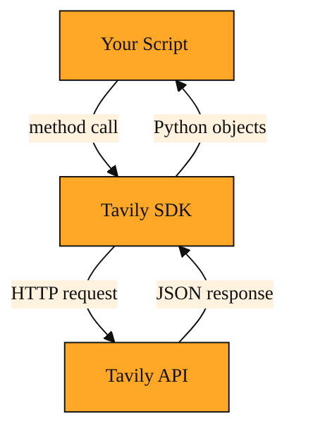

# A Simpler Way to Call Tavily from Python

## Why an SDK beats writing web requests by hand

So far in this course you have learned how to steer Tavily's behavior. You know about domain filtering, extract_depth, chunks per source, and how to keep your program moving with AsyncTavilyClient. But all of those controls need a home inside your code. They live inside a Python package you install with pip. That package is the Tavily Python SDK.

Without it, your script would have to speak directly to Tavily's servers over the web. That means hand-crafting HTTP requests every time you wanted something. You would build a URL, attach your API key in a header, format the body as JSON, send it, and then parse the response back into something Python understands. If you wanted to map a site to see its layout, or crawl a set of pages to gather text, you would repeat that manual process for each call. When Tavily added a new option or refined a return shape, you would update your request-building code by hand. The Tavily Python SDK exists to remove that friction entirely. It is a toolkit that wraps Tavily's service in familiar Python objects and methods. You import it, create a client, and call plain-language methods. The SDK worries about the web protocol, the headers, and the JSON so you can focus on what you are trying to learn.

## Understanding the idea

An SDK, or software development kit, is simply a helper library written by Tavily. You install it once through pip, and it lives inside your project like any other Python package. From there, your script speaks Python, and the SDK translates those instructions into the exact network calls Tavily's servers expect.

Picture a restaurant with a menu written in another language. You could study the language, write your order on a slip, and hope the kitchen understands your handwriting. Or you could ask a waiter who is fluent in both languages to take your order for you. The SDK is that waiter. You say something natural in Python like "search for this topic" or "map that website," and the SDK makes sure the kitchen gets the details right.

Because the SDK lives inside your code, it also keeps your API key tidy, validates your options, and returns data in familiar Python shapes such as dictionaries and lists. You do not have to think about HTTP status codes or JSON parsers unless something truly unexpected happens.

*Figure: How the Tavily SDK sits between your Python code and Tavily's API to handle the web protocol for you.*

<InlineQuiz
  id="quiz-s2-l7-sdk-core-purpose"
  question="What problem does the Tavily Python SDK solve for you?"
  options='["It handles the web protocol, headers, and JSON so you can use familiar Python method calls instead of crafting raw network requests.","It gives you a visual dashboard to build search requests without writing code.","It downloads and stores every web page you access so searches work offline.","It runs the search engine locally on your machine instead of contacting Tavily’s servers."]'
  correct="0"
  explanation="The correct answer is A because the lesson describes the SDK as a helper library that translates your Python instructions into the exact network calls Tavily expects and returns data as ordinary Python objects like dictionaries and lists. Option B is tempting because toolkits are sometimes visual, but the SDK is a Python package you import into scripts, not a dashboard. Option C confuses the SDK with an offline storage tool; the SDK talks to Tavily's servers live over the web. Option D confuses the client library with the server itself; the SDK still sends requests to Tavily's API rather than running searches locally."
  courseSlug="tavily-live-web-answers-for-builders-beginner"
  lessonSlug="07-a-simpler-way-to-call-tavily-from-python"
/>

## A simple example

Imagine you are writing a small script to prepare for a team meeting. You want to understand the structure of a competitor's documentation site before deciding which pages to read in depth.

With the Tavily Python SDK installed, your script can first ask Tavily to map the site. Mapping gives you a bird's-eye list of URLs and paths without downloading every page. Then, when you spot the sections that matter, you can crawl just those areas to pull the actual text. If you tried to do this without the SDK, you would need to manage multiple endpoints and handle the JSON responses yourself. The SDK lets you move from "I wonder what is on this site" to "here are the exact pages I need" using ordinary Python method calls. You never had to write a raw web request, manage a connection, or parse a blob of JSON by hand. The SDK turned your research question into action with far less code than doing it yourself.

## How to think about it

The Tavily Python SDK is the bridge between your ideas and Tavily's engine. When you are working in Python, it is the natural way to reach for search, site mapping, or crawling. You already know some of its pieces, such as the async client and options like domain filtering, max_depth, instructions, or path patterns. Now you can see them as parts of a single, coherent toolkit rather than isolated tricks. Whenever you want Tavily to do work inside a Python script, this is the front door you walk through.

## Where you'll see this next

Now that you see the SDK as your central toolbox, the next lessons will open up specific jobs you can hand to it. We will look at pulling clean content from a single URL with Extract, narrowing searches with date windows, and wiring these powers into larger tools like LangChain. The SDK is the foundation. What you build on top of it is where things get interesting.

---
[← Previous](./06-why-the-api-says-no-to-your-first-request.md) · [Next →](./08-how-do-you-stop-a-crawl-from-eating-all-your-credits.md) · [Course home](./README.md)
