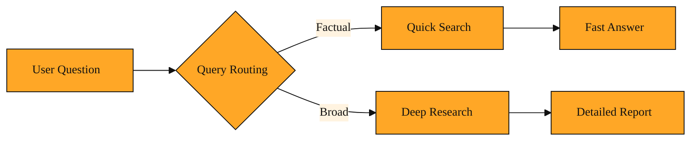

# The Fast Way to Answer Everyday Questions

## Why this exists

By now you have seen how powerful deep research can be. In earlier lessons you learned about the Research API. It can map a whole website, crawl dozens of pages, extract key facts, and stitch everything together into a thorough answer. That depth is perfect when a user asks something broad like "What are the latest trends in renewable energy?" or "Compare the top three project management tools for remote teams." The agentic loop gives you citations, context, and coverage you can trust.

But here is the everyday problem. Not every question needs an investigation.

Imagine someone asks your app, "What time does the keynote start?" or "Who is the current CEO of Stripe?" Sending those to a full research agent is like calling a private investigator to read a billboard. The agent would spin up, crawl pages, extract chunks, track a session, and burn API credits. All to find a single sentence that was already sitting in the first search result.

Without a lighter option, every query gets the heavy treatment. Users wait longer than they need to. You spend more credits. And simple factual lookups feel unnecessarily slow. The missing piece is a fast path for the easy stuff.

That gap is exactly what Quick Search fills.

## Understanding the idea

Quick Search is the fast lane. It is a mode of Tavily Search designed for questions that are straightforward and narrow. Instead of running a multi-step research loop, it performs a single, targeted search and returns the most relevant results right away.

Think of the Research API as hiring a research assistant to write a full briefing. They read widely, take notes across many pages, and synthesize a report. Quick Search is more like asking a well-read friend who already knows the answer. They give you the top three links and a short summary, and you are done in seconds.

Behind the scenes, the system uses Query Routing. That is just the step that sizes up a question and picks the right path. If the question looks simple and factual, Query Routing sends it to Quick Search. If the question looks broad or comparative, it sends it to deep research. You can picture a traffic director at a fork in the road. Straight ahead for a quick errand, scenic route for a road trip.

The key thing to remember is that Quick Search is still Tavily Search. It uses the same API, the same real-time web index, and the same quality standards. The only difference is the scope. It stops at the answer instead of digging for a dissertation. There are no separate credentials to manage and no new client to learn. It is the same tool, simply asked to do less.

*Figure: Query Routing acts like a traffic director, sending simple factual questions to Quick Search and broad comparative questions to Deep Research.*

<InlineQuiz
  id="quiz-s2-l9-quick-search-concept"
  question="What is the main difference between Quick Search and Tavily's deep research mode?"
  options='["Quick Search uses a separate API and credentials, while deep research uses the standard Tavily Search endpoint.","Quick Search performs a single targeted search for straightforward questions, while deep research runs a multi-step loop to synthesize many sources.","Quick Search skips the live web index and answers from a smaller static database, while deep research crawls the full internet.","Quick Search returns raw links without any summary, while deep research produces a fully written report."]'
  correct="1"
  explanation="Quick Search is described as the fast lane for narrow, factual questions. It performs a single search and returns relevant results with a short summary, whereas deep research acts like a research assistant that reads widely and synthesizes a detailed report. The lesson emphasizes that both modes use the same Tavily Search API, the same real-time web index, and the same quality standards, so the first and third options are wrong. The second option is correct because the lesson explicitly contrasts a single targeted search with a multi-step research loop. The fourth option is wrong because Quick Search does include a summary; the difference is scope, not formatting."
  courseSlug="tavily-live-web-answers-for-builders-beginner"
  lessonSlug="09-the-fast-way-to-answer-everyday-questions"
/>

## A simple example

Picture a customer support chatbot that can answer questions about your product and the wider industry.

A user types: "Does your software support single sign-on?" That is a closed, factual question. The bot uses Quick Search. It calls Tavily Search once, finds your documentation page about SSO, and replies immediately with a yes and a link. The whole exchange takes a second.

Later, another user asks: "How do our competitors handle enterprise security compared to us?" That is open-ended and comparative. The bot routes this to the Research API. It maps competitor sites, extracts security whitepapers, crawls comparison pages, and builds a detailed response over several steps.

Both answers come from Tavily. The first just took the express lane because the question was simple. The user got what they needed without waiting for a research report they never asked for.

## How to think about it

Quick Search is your default path for anything that feels like a lookup rather than a project. If the answer is probably on the first page of results and requires no synthesis across many sources, this is the tool to reach for. It keeps your app feeling snappy and your credit usage sensible.

You already know the pieces that make this possible. The Tavily Search endpoint you explored earlier is the engine. Session tracking and project IDs help you organize these calls just like you organize deep research. The difference is simply how much work you ask the engine to do. You trade breadth for speed on purpose.

## Tying the journey together

Over these nine lessons, you have moved from the basics of Tavily Search all the way through extraction, crawling, session tracking, and deep research. You have seen how to pull raw facts from a single page, how to crawl an entire site, and how to let an agent run a sprawling investigation. Along the way, you have glimpsed the wider ecosystem, from the Python and JavaScript clients to the CLI and the agent toolkit.

Quick Search brings the journey full circle. It reminds us that more power does not always mean more steps. The same platform that can run a massive research project can also answer a simple question in a heartbeat. The art is knowing which moment calls for which mode.

When you build with Tavily, you are not choosing between fast and smart. You are learning to match the depth of the tool to the depth of the question. Start with the fast path. Reach for the deep path when the question truly demands it. That is the difference between a search feature and a truly helpful AI product.

---
[← Previous](./08-how-do-you-stop-a-crawl-from-eating-all-your-credits.md) · [Course home](./README.md)
