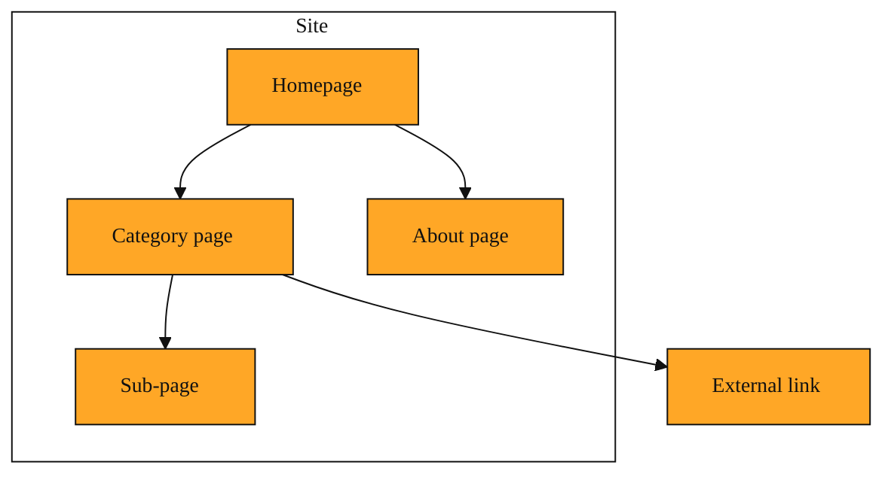

# How to Map a Website Without Opening a Hundred Tabs

In the last lesson, you saw how Tavily gives AI access to the live web. It is the bridge that lets an assistant look up facts that did not exist when it was trained. That works beautifully when you already know what question to ask. But what happens when you land on a website and have no idea what is inside? You see a homepage and a few menus, yet the real value might sit three clicks deep in a page you do not know exists. That is the gap tavilyMap fills.

tavilyMap is a structure discovery tool. You hand it a starting web address, and it traces the paths inside that site. It moves from link to link, building a picture of what pages exist and how they connect. Think of it as sending a scout ahead. The scout does not sit down and read every word. It simply walks the halls, checks the doors, and returns with a list of rooms. This gives you a working map of the territory before you decide where to dig.

## Why wandering blind is not an option

Without a map, you are left to guess. You might click through menus by hand, hoping to stumble onto the right documentation page. You might write a script that visits one guessed URL after another, hitting dead ends and broken links. This is slow. It misses pages that are not linked from obvious places. And if the site is large, you will give up long before you see the full picture.

tavilyMap solves this by treating a website like a graph. In everyday terms, a graph is just a set of dots connected by lines. Each page is a dot. Each link is a line. The tool starts at your chosen homepage dot, then follows the lines outward. Because it can explore many paths at once, it covers ground fast. It can also respect boundaries. You can tell it how many levels deep to go, or which hallways to ignore, so it does not wander off into irrelevant corners or external sites. That means you get a complete view of the property without the noise of the rest of the internet.

The result is a site map. Not a visual map with streets, but a structured list of URLs that shows you the shape of the entire property. Some entries might ride along with a brief automatic summary of the page, called Content, just enough to tell you whether that room is a kitchen or a closet. If a door is locked, or a page cannot be reached, the tool notes that in what it calls a FailedResult. You do not need to memorize those names. They are simply details that travel with the list.

*Figure: How tavilyMap sees a website: pages as nodes, links as paths, and a boundary that keeps exploration on-site.*

## A practical picture

Imagine you just discovered a new online archive of public domain books. The homepage mentions thousands of titles, but the search box is hidden and the categories are unclear. You want to know if the site has science fiction from the 1950s, but you also want to see what else is there before you commit to reading.

You point tavilyMap at the archive’s homepage. You tell it to stay within the site and not go more than a few clicks deep. It goes to work. A moment later it returns a list. You see paths like /genres/science-fiction, /genres/mystery, /decades/1950s, and /about/licensing. You now have a floor plan. You know where the science fiction lives. You also notice a licensing page you would never have clicked otherwise. The scout did its job. You did not have to open fifty tabs or write any loop that guesses file names.

## How to hold this in your head

Think of tavilyMap as the survey step before the build. It answers the question, “What is even on this site?” It does not answer, “What does page seventeen say?” It gives you the skeleton so you can decide where to look next. When you are building an AI agent that needs to research a whole company, audit a documentation hub, or monitor a blog, you start with the map. It turns an unknown forest into a set of marked trails. You would reach for it whenever you need to discover structure rather than consume content. If you only need a single fact, a search is faster. If you need to know the layout, a map is essential.

<InlineQuiz
  id="quiz-s3-l2-tavilymap-purpose"
  question="You are building an AI agent that must explore a large documentation site. Which situation makes tavilyMap the right first step?"
  options='["You need to discover what pages exist and how they connect before deciding where to dig deeper.","You already know the exact URL you need and want to extract the full text from that single page.","You want to ask a specific question and get a direct answer from the latest information across the whole web.","You need the tool to read and summarize every word on every page so you do not have to visit them later."]'
  correct="0"
  explanation="tavilyMap is built for reconnaissance. It traces links to reveal the layout and connections between pages so you can decide what matters, much like a scout returning with a floor plan. Option two describes extracting content from a known page, which is a different task the lesson saves for later. Option three describes searching the live web for a single fact, which the lesson says is faster with search rather than mapping. Option four assumes the tool reads and summarizes everything, but the lesson emphasizes that tavilyMap gives you the skeleton, not the full content of each page."
  courseSlug="tavily-live-web-answers-for-builders-beginner"
  lessonSlug="02-how-to-map-a-website-without-opening-a-hundred-tabs"
/>

## Where this leads next

A map is only useful if you do something with it. Once you know which pages matter, the natural next step is to pull the actual text from them. In the coming lessons, you will see how to extract the full contents of a single URL, crawl an entire section, and manage the usage and limits that come with real workloads. For now, remember that tavilyMap is your reconnaissance tool. It is how you stop guessing and start knowing what a website contains.
