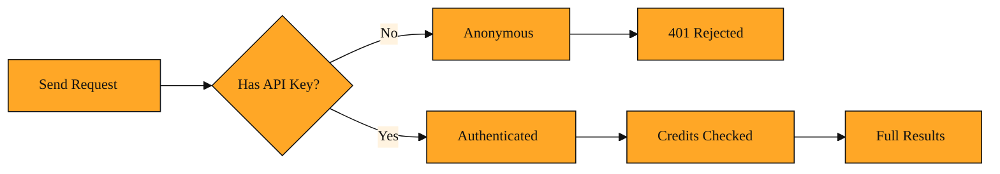

# Why the API Says No to Your First Request

Imagine you have spent the last few lessons getting comfortable with Tavily Search API. You understand how a query works, how search_depth changes the thoroughness of results, and how tools like Tavily Extract pull structured facts from web pages. Maybe you have even experimented with LangChain or Mastra connectors. You feel ready. You write what looks like a perfect request, send it out, and wait.

The response comes back: "Unauthorized." No results. No explanation beyond a status code. The door is locked.

This is the universal bump every developer hits when moving from learning an API to actually using it. Public documentation can be read by anyone, but the live service needs to know who is calling. It needs to check if your account is active, if you have API Credits remaining, and which limits apply to you. Without that proof, the only safe answer is no. An anonymous request cannot spend credits and cannot be traced back to an owner.

Keyed access exists to solve this exact problem. It is the simple act of sending a secret identifier with every request so the API knows it is really you.

## How the API recognizes your call

Think of keyed access like a membership card at a coworking space. The space has desks, printers, and meeting rooms. You can look through the window, but to sit down and work, you must swipe your card at the reader. The card does not give you the internet; it tells the building whose account to charge for the coffee and the printing. If your card is fake or expired, the reader flashes red and the door stays closed.

In the world of APIs, that card is an API key. With keyed access, you place this key into a special header called Authorization, using a format called Bearer auth. Conceptually, you are saying, "Here is my token. I am the bearer of this credential." When Tavily's servers receive your request, they look at that header first. They validate the key, check your API Credit balance, and only then decide to process the search or extraction you asked for.

The presence of a valid key also takes precedence over any limited keyless mode. Once you send a proper key, the system stops treating you like an anonymous visitor and starts treating you like an account holder. Your requests consume your allocated limits, and you unlock the full depth of the service rather than a shallow preview.

There is one more small convenience. If you share a single API key across several apps or environments, you can add an optional header called X-Project-ID. Think of it as writing a department code on your membership card. It does not change who you are, but it lets you sort your usage later, so you can see which project spent how many credits.

*Figure: The API evaluates your identity before it ever looks at your query; this is the gate that separates anonymous visitors from account holders.*

<InlineQuiz
  id="quiz-s1-l6-api-key-purpose"
  question="What is the main reason a live API like Tavily requires a valid API key before processing your request?"
  options='["It proves your identity so the API can verify your account and available credits.","It encrypts your search query and response so outsiders cannot read them.","It tells the API which topics and websites you are permitted to search.","It translates your query into the internal format the server understands."]'
  correct="0"
  explanation="The API key is an identity credential. Tavily checks it to verify your account, confirm you have API Credits remaining, and trace the request back to you. Anonymous requests cannot spend credits and cannot be traced to an owner, so the only safe response is to reject them. The key does not encrypt your query, restrict which topics you can search, or change how the query is formatted; those are separate concerns. Its only job is to tell the API whose account to charge and whether the door should open."
  courseSlug="tavily-live-web-answers-for-builders-beginner"
  lessonSlug="06-why-the-api-says-no-to-your-first-request"
/>

## The moment the door opens

Meet Jordan. Jordan is building a marketing research assistant that needs to scan social platforms and summarize company websites. Jordan plans to use tools from the Tavily Agent Toolkit, such as search_social_media and crawl_and_summarize, to gather raw material and then shape the final report. Jordan writes the agent logic, crafts the query, and runs the code.

The first run fails. The API returns an authentication error because the request arrived without any identity attached. An anonymous call cannot access account-specific tools or spend API Credits.

Jordan adds the API key into the Authorization header as a Bearer token. On the next run, the API recognizes the key immediately. It verifies the account, confirms credits are available, and processes the request. Social media posts and web summaries flow back with source URLs and inline citations. Jordan opens the usage dashboard and sees the API Credits tick down, which is exactly what should happen when an authenticated request succeeds. Because Jordan is running this for two different clients, Jordan also adds a project ID to the headers. Now the dashboard shows two separate piles instead of one confusing heap.

That is keyed access in action. It is not a feature you use once; it is a signal you send every single time you want the API to treat the request as yours.

## The habit that carries every request

Keyed access is the identity layer sitting in front of everything you have learned so far. It does not change how queries are written or how search_depth behaves. It simply determines whether the data is allowed to reach you at all.

Whenever you read about the Tavily Python SDK, the JavaScript SDK, or integrations you have already explored like langchain-tavily and @mastra/tavily, remember that underneath each one, a small piece of code is slipping that Bearer token into the headers for you. The key is the bridge between your code and your account. It survives every abstraction layer. Without it, you are knocking on a locked door. With it, the system knows whose meter to run and which results to return.

In the next lessons, we will stop talking about headers in the abstract and start writing real code with the Tavily Python SDK. You will use this same API key to unlock Map, which discovers the layout of a website, and Crawl, which walks through entire sites to gather content. Once your key is in place, moving from idea to everyday usage will feel completely natural.
