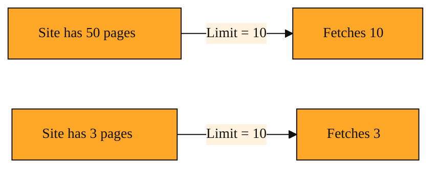

# How do you stop a crawl from eating all your credits?

## Why a crawl needs a ceiling

What happens if I point Tavily at a huge site and it finds thousands of pages? Will it fetch them all? Will my API credits vanish before my coffee gets cold? Could my app hang while it waits for a small library of web pages to download?

You have already seen how Tavily can map a website to find every URL, then extract clean content from the pages you choose. That is powerful. It is also a little dangerous if left unchecked.

Without a guardrail, an automated crawl is like a vacuum cleaner with no bag limit. It keeps sucking until someone turns it off. Every page Tavily fetches costs API credits. If you are experimenting with a new site, you do not want a surprise bill because the crawler discovered a ten-year-old blog archive you forgot existed. You also do not want your script to sit there for minutes collecting far more data than you need.

That is why Tavily gives you a single, simple knob called **limit**.

## Understanding the idea

Think of limit as a hard cap on your shopping cart. You walk into a store and say, "I will buy at most five items." Once the fifth item is scanned, the cashier closes the lane. It does not matter if the store has five thousand more products. You stop at five.

When you ask Tavily to crawl a site, limit is the number you pass in to say, "Fetch at most this many pages, then stop." It does not change how Tavily picks which pages to visit first. It simply sets a ceiling on the total count. If the site has fifty pages and your limit is ten, you get ten and the crawl ends. If the site has only three pages and your limit is ten, you get three and the crawl ends. The parameter respects your budget in both directions.

This pairs naturally with what you already know. You have used Map to discover URLs and Query-Focused Extraction to pull targeted content. Limit adds the third leg of the stool: volume control. It turns open-ended exploration into a predictable, budget-friendly operation. You can think of it as bringing the same common-sense habit you use with web_search, where you request a reasonable number of results, into the world of crawling entire sites. Whether you reach for the Python SDK or the JavaScript SDK, the limit parameter works the same way.

*Figure: How limit behaves as a hard ceiling on both large sites and small sites.*

<InlineQuiz
  id="quiz-s2-l8-crawl-limit-ceiling"
  question="Why does Tavily provide a limit parameter for site crawls?"
  options='["To place a hard ceiling on how many pages are fetched so your API credits and wait time stay predictable","To tell Tavily which pages are most relevant to your query so it visits those first","To guarantee that Tavily fetches exactly that many pages even if the site is smaller","To act as a stopwatch that limits how many seconds the crawl is allowed to run"]'
  correct="0"
  explanation="The limit parameter sets a hard ceiling on the total number of pages Tavily will fetch, protecting you from surprise bills and long waits. It does not influence which pages Tavily chooses to visit first; that is a separate routing concern you will learn about next. It is also not a promise of exactly that many pages, because the crawl ends early if the site has fewer pages than your cap. Finally, it counts pages, not seconds, so it is not a timeout mechanism."
  courseSlug="tavily-live-web-answers-for-builders-beginner"
  lessonSlug="08-how-do-you-stop-a-crawl-from-eating-all-your-credits"
/>

## A simple example

Imagine you are building a small chatbot that answers questions about your company's internal handbook. The handbook lives on a website, and you are not sure if it is fifty pages or five hundred. You want to load the content into a knowledge base, but you are still in testing mode.

You send Tavily a crawl request aimed at the handbook domain and you set the limit to five. Tavily fetches five pages, returns the structured content, and stops. You spend only the credits those five pages require. You inspect the results. If they look good, you run the crawl again with a higher limit or tighter instructions. If they do not, you adjust your query without having burned through a month of credits.

The limit makes the crawl behave like a sampler, not a bulldozer.

## How to think about it

Limit is your emergency brake and your sampling tool in one. Whenever you are pointing Tavily at an unfamiliar site, or whenever you are running a crawl inside an app that users can trigger, you should treat limit as a safety habit. It says, "I trust the tool, but I want a ceiling." You already learned to focus your extractions with specific queries. Limit focuses your spend by capping the volume.

You will see this guardrail appear everywhere from Data Collection scripts to LangChain tool wrappers to Demo Apps and Web Research Agents, because the need for cost control is universal. Whether you are doing Site discovery, URL Content Extraction, or preparing content for a vector store, the story is the same. Decide the maximum scope up front, and let Tavily enforce it. That way, your exploration stays cheap, fast, and safe.

## Where you'll see this next

Limit answers the question, "How much should I fetch?" In the next lesson, we will move to the question, "How does Tavily decide which pages deserve those limited slots?" You will meet Quick Search, Query Routing, and the Research agent patterns that help Tavily choose what to return. Once you can control the volume, the next step is understanding how the system routes your request to the right depth and format. Limit keeps you safe; routing makes you smart.
